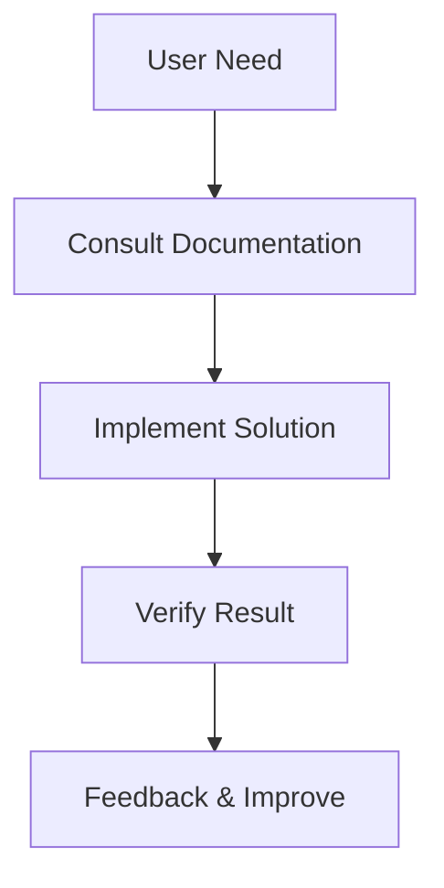

# Nodra Framework (English Documentation)

This directory contains English documentation for the Nodra framework.

## 📚 Documentation List

### Core Documentation

- [Architecture Design](./ARCHITECTURE.md) - System architecture and design principles
- [API Reference](./API_REFERENCE.md) - Complete REST API reference
- [Deployment Guide](./DEPLOYMENT.md) - Production deployment best practices
- [Troubleshooting Guide](./TROUBLESHOOTING.md) - Common issues and solutions
- [Performance Optimization](./PERFORMANCE.md) - Performance tuning for large-scale applications
- [Development Roadmap](./ROADMAP.md) - Detailed development plan

### Developer Guides

- [Quick Start](./QUICK_START.md) - 5-minute getting started guide _(planned)_
- [Developer Guide](./DEVELOPER_GUIDE.md) - Detailed development tutorial _(planned)_
- [Plugin Development](./PLUGIN_DEVELOPMENT.md) - Custom plugin development _(planned)_

### User Documentation

- [User Manual](./USER_MANUAL.md) - End-user usage guide _(planned)_
- [Admin Guide](./ADMIN_GUIDE.md) - System administration documentation _(planned)_

### Reference Materials

- [Glossary](./GLOSSARY.md) - Technical terminology explanations _(planned)_
- [Best Practices](./BEST_PRACTICES.md) - Recommended development patterns _(planned)_
- [Security Guide](./SECURITY.md) - Security configuration and best practices _(planned)_

---

## 🌐 Language Support

Nodra provides multi-language documentation support:

| Language    | Directory  | Status            |
| ----------- | ---------- | ----------------- |
| **Chinese** | `docs/zh/` | ✅ Available      |
| **English** | `docs/en/` | 🚧 In Development |

---

## 📖 Documentation Features

### 🎯 User-Focused

- **Developer Docs**: Complete tutorials from beginner to advanced
- **Operations Docs**: Production deployment and troubleshooting
- **User Docs**: Non-technical user usage guides

### 📚 Content Structure

- **Progressive Learning**: From basic concepts to advanced applications
- **Practice-Oriented**: Extensive code examples and best practices
- **Problem-Solving**: Systematic troubleshooting and debugging guides

### 🔧 Technical Depth

- **Architecture Analysis**: Deep understanding of framework design principles
- **Performance Optimization**: Performance tuning strategies for large-scale applications
- **Security Practices**: Comprehensive security configuration and protection measures

---

## 🤝 Contributing

We welcome community contributions! You can help us improve:

### 📝 Improve Documentation

- Fix errors and inaccuracies
- Add missing content and examples
- Improve documentation structure and readability
- Translate documentation to other languages

### 🌍 Multi-language Contributions

- **Translate Existing Docs**: Translate Chinese documentation to English
- **Create New Language Versions**: Support users in more languages
- **Maintain Language Consistency**: Ensure content synchronization across versions

### 📋 Contribution Process

1. Fork the project repository
2. Create a feature branch: `git checkout -b docs-improvement`
3. Commit your changes: `git commit -m "docs: improve API documentation"`
4. Create a Pull Request

### 📧 Contact Information

- **Documentation Issues**: docs@nodra.dev
- **Technical Discussions**: discussions@nodra.dev
- **Security Issues**: security@nodra.dev

---

## 📊 Documentation Statistics

| Type                | Count  | Total Lines  |
| ------------------- | ------ | ------------ |
| Core Documentation  | 7      | ~45,000      |
| Developer Guides    | 4      | ~25,000      |
| User Documentation  | 2      | ~15,000      |
| Reference Materials | 4      | ~20,000      |
| **Total**           | **17** | **~105,000** |

---

## 🔍 Documentation Navigation

### 🚀 Quick Navigation

```bash
# API Quick Reference
curl -s "https://raw.githubusercontent.com/nodra/nodra/main/docs/en/API_REFERENCE.md" | grep -A 5 -B 5 "POST /api"

# Deployment Checklist
curl -s "https://raw.githubusercontent.com/nodra/nodra/main/docs/en/DEPLOYMENT.md" | grep -A 10 "Pre-deployment Check"
```

### 📱 Offline Documentation

```bash
# Generate offline documentation
git clone https://github.com/nodra/nodra.git
cd nodra/docs
pandoc README.md -o Nodra_Documentation.pdf
```

### 🔍 Documentation Search

All documentation supports full-text search:

```bash
# Search in documentation directory
cd docs/en
grep -r "JWT authentication" .

# Use ripgrep (recommended)
rg "JWT authentication" docs/en/
```

---

## 🏷️ Documentation Standards

### 📝 Writing Style

- **Clear and Concise**: Use simple, understandable language
- **Consistent Structure**: Unified heading and paragraph format
- **Example-Rich**: Every concept includes code examples
- **Problem-Solving Oriented**: Focus on solving real-world problems

### 🎨 Format Standards

- **Markdown**: Use standard Markdown syntax
- **Code Highlighting**: Specify language type for all code blocks
- **Clear Tables**: Use tables for structured information
- **Complete Links**: Use relative paths for internal references

### 📸 Diagram Examples



---

_Last updated: 2026-02-12_
